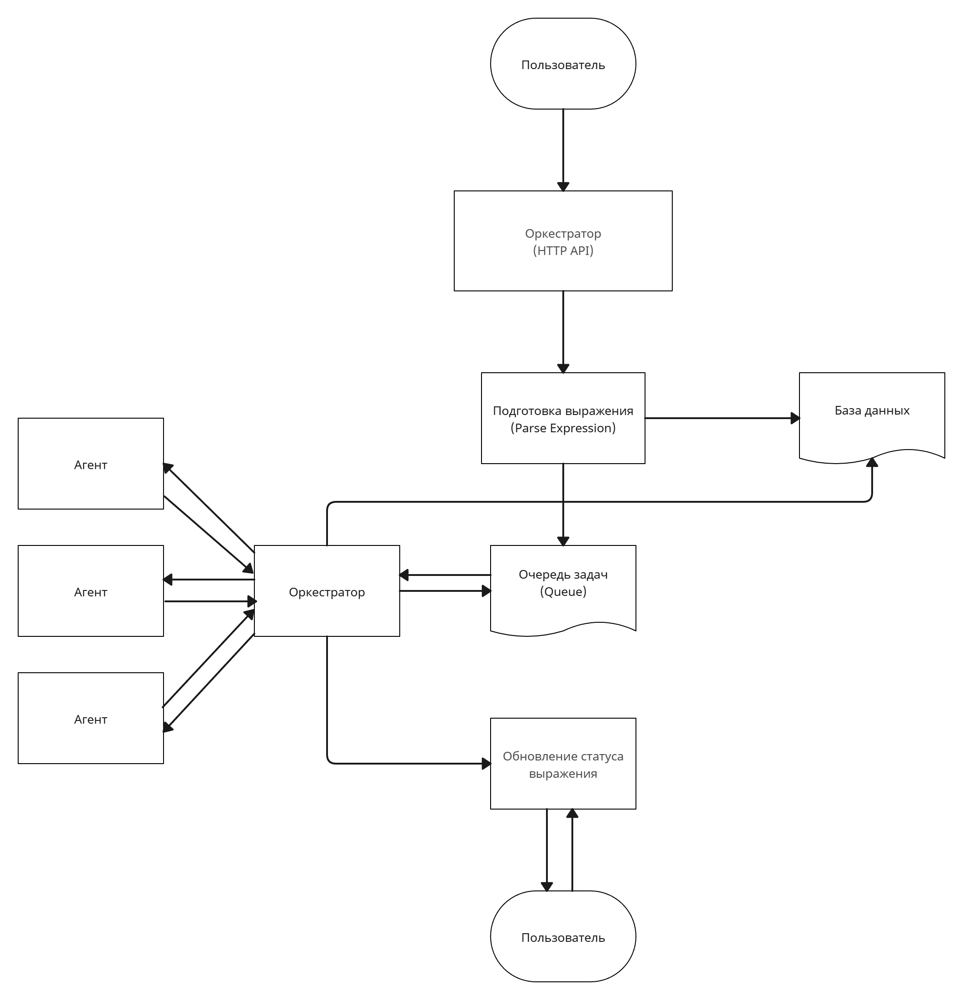

<h1 align=center>
    <b>
        Distributed Arithmetic Expression Calculator
    <b>
</h1>

[](https://github.com/docker/compose/releases/latest)


Данный проект представляет собой простой распределённый вычислитель арифметических выражений.

## Запуск

1. Установите [Docker](https://www.docker.com/get-started/)
2. Установите [Git](https://git-scm.com/downloads) (при использовании далее способа с клонированием через git clone)
3. Склонируйте проект через команду:
    ```console
    git clone https://github.com/fstr52/final-calculator
    ```

    Или просто скачайте ZIP-архив проекта (зеленая кнопка Code над файлами проекта, затем Download ZIP)
4. Перейдите в директорию проекта
5. Запустите приложение через команду (для linux используйте makefile):
    ```console
    docker-compose up
    ```
6. Сервис доступен по адресу: `http://localhost` в браузере (или `http://localhost:8080` при работе через postman)


## Конфигурация запуска

Для смены порта запуска измените параметры необходимых файлов в папке /config и заново запустите приложение

## Как это работает



## Примеры использования 

1. **Регистрация**

    Curl запрос:
    ```bash
    curl --location "localhost:8080/api/v1/registration" --header "Content-Type: application/json" --data "{\"login\": \"John Doe\", \"password\": \"qwerty\"}"
    ```

    Тело запроса (для простоты визуализации и понимания):
    ```json
    {
        "login": "John Doe",
        "password": "qwerty"
    }
    ```

    Ответ:
    ```json
    {
        "result": "You successfully registered!"
    }
    ```
    HTTP статус:
    ```
    200 OK
    ```

2. **Вход в аккаунт**

    Curl запрос:
    ```bash
    curl --location "localhost:8080/api/v1/registration" --header "Content-Type: application/json" --data "{\"login\": \"John Doe\", \"password\": \"qwerty\"}"
    ```

    Тело запроса (для простоты визуализации и понимания):
    ```json
    {
        "login": "John Doe",
        "password": "qwerty"
    }
    ```

    Ответ:
    ```json
    {
        "token": "743feiwsdkfj...4w2"
    }
    ```
    HTTP статус:
    ```
    200 OK
    ```


3. **Добавление нового выражения**

    Curl запрос:
    ```bash
    curl --location "localhost:8080/api/v1/calculate" --header "Content-Type: application/json" --header "Authorization: 743feiwsdkfj...4w2" --data "{\"expression\": \"12*(1+2*(1+2)+3)+1\"}"
    ```

    Тело запроса (для простоты визуализации и понимания):
    ```json
    {
        "expression": "12*(1+2*(1+2)+3)+1"
    }
    ```

    Ответ:
    ```json
    {
        "id": "8j9r04rds6...1gi",
        "status": "in_queue"
    }
    ```
    HTTP статус:
    ```
    200 OK
    ```

4. **Показ списка выражений**

    Curl запрос:
    ```bash
    curl --location "localhost:8080/api/v1/expressions"
    ```

    Ответ:
    ```json
    {
        "expressions": [
            {
                "id": "8j9r04rds6...1gi",
                "status": "done",
                "success": true,
                "result": 5,
                "expression": "12*(1+2*(1+2)+3)+1",
                "created_at": "2025-05-11T13:41:32.024171Z",
            }
        ]
    }
    ```
    HTTP статус:
    ```
    200 OK
    ```
3. **Конкретное выражение по его ID**

    Curl запрос:
    ```bash
    curl --location "localhost:8080/api/v1/expressions/:id"
    ```

    Ответ:
    ```json
    {
        "expression":
            {
                "id": "8j9r04rds6...1gi",
                "status": "done",
                "success": true,
                "result": 5,
                "expression": "12*(1+2*(1+2)+3)+1",
                "created_at": "2025-05-11T13:41:32.024171Z",
            }
    }
    ```
    HTTP статус:
    ```
    200 OK
    ```

## Все возможные результаты запросов

### Результат калькуляции и код `200 OK`:

*Ниже приведены curl-запросы, но рекомендую использовать [Postman](https://www.postman.com/downloads/) для удобства*

Запрос: 
```bash
curl --location "localhost:8080/api/v1/calculate" --header "Content-Type: application/json" --data "{\"expression\": \"2+3\"}"
```
Ответ:
```json
{"result":"5"}
```
HTTP статус:
```
200 OK
```

### Ошибка и HTTP status code
1. **Неверное выражение** <br>
    Запрос: 
    ```bash
    curl --location "localhost:8080/api/v1/calculate" --header "Content-Type: application/json" --data "{\"expression\": \"(2+3\"}"
    ```
    Ответ:
    ```
    Invalid expression
    ```
    HTTP статус:
    ```
    422 Unprocessable Entity
    ```
2. **Неверный формат ввода**<br>
    Запрос: 
    ```bash
    curl --location "localhost:8080/api/v1/calculate" --header "Content-Type: text/plain" --data "{\"expression\": \"2+3\"}"
    ```
    Ответ:
    ```
    Wrong content-type, expected JSON
    ```
    HTTP статус:
    ```
    400 Bad Request
    ```
3. **Неверный метод запроса**<br>
    Запрос: 
    ```bash
    curl --location --request GET  "localhost:8080/api/v1/calculate"  --header "Content-Type: application/json"  --data "{\"expression\": \"2+3\"}"
    ```
    Ответ:
    ```
    Wrong method, expected POST
    ```
    HTTP статус:
    ```
    405 Method Not Allowed
    ```
4. **Непредвиденная ошибка**<br>
    Ответ:
    ```
    Internal server error
    ```
    HTTP статус:
    ```
    500 Internal server error
    ```

## Примечание

- Поддерживаются стандартные арифметические операции (+, -, *, /)
- Вычисления происходят ассинхронно

## Контакты

При появлении вопросов Вы можете обратиться к [автору](https://t.me/fstrrr)