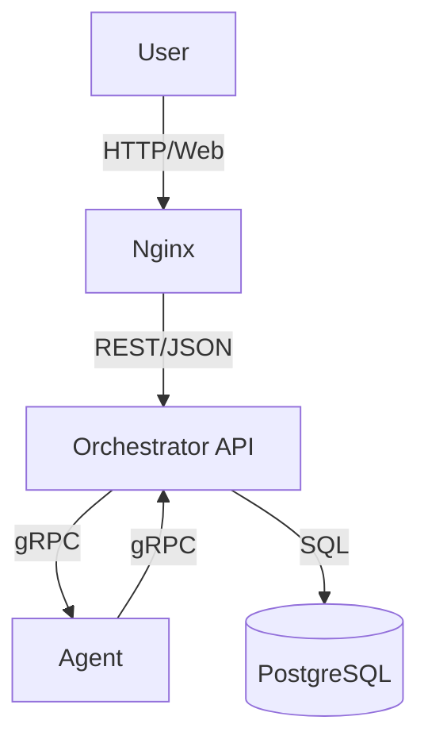

<h1 align=center>
    <b>
        Distributed Arithmetic Expression Calculator
    <b>
</h1>

[](https://github.com/docker/compose/releases/latest)

[](LICENSE)
[](https://goreportcard.com/report/github.com/fstr52/final-calculator)
[](https://t.me/fstrrr)


Данный проект представляет собой простой распределённый вычислитель арифметических выражений.

## Запуск

1. Установите [Docker](https://www.docker.com/get-started/)
2. Установите [Git](https://git-scm.com/downloads) (при использовании далее способа с клонированием через git clone)
3. Склонируйте проект через команду:
    ```console
    git clone https://github.com/fstr52/final-calculator
    ```

    Или просто скачайте ZIP-архив проекта (зеленая кнопка Code над файлами проекта, затем Download ZIP)
4. Перейдите в директорию проекта
5. Запустите приложение через команду:
    ```console
    docker-compose up --build
    ```
6. Сервис доступен по адресу: `http://localhost` в браузере (или `http://localhost:8080` при работе через postman)

## Конфигурация запуска

Для смены параметров запуска измените необходимые элементы в папке /config и заново запустите приложение

## Как это работает

<summary><b>Архитектура (Mermaid-схема для GitHub)</b></summary>



## Примеры использования 

1. **Регистрация**

    Curl запрос:
    ```bash
    curl --location "localhost:8080/api/v1/register" --header "Content-Type: application/json" --data "{\"login\": \"John Doe\", \"password\": \"qwerty\"}"
    ```

    Тело запроса (для простоты визуализации и понимания):
    ```json
    {
        "login": "John Doe",
        "password": "qwerty"
    }
    ```

    Ответ:
    ```json
    {
        "result": "You successfully registered!"
    }
    ```
    HTTP статус:
    ```
    200 OK
    ```

2. **Вход в аккаунт**

    Curl запрос:
    ```bash
    curl --location "localhost:8080/api/v1/login" --header "Content-Type: application/json" --data "{\"login\": \"John Doe\", \"password\": \"qwerty\"}"
    ```

    Тело запроса:
    ```json
    {
        "login": "John Doe",
        "password": "qwerty"
    }
    ```

    Ответ:
    ```json
    {
        "token": "743feiwsdkfj...4w2"
    }
    ```
    HTTP статус:
    ```
    200 OK
    ```


3. **Добавление нового выражения**

    Curl запрос:
    ```bash
    curl --location "localhost:8080/api/v1/calculate" --header "Content-Type: application/json" --header "Authorization: Bearer 743feiwsdkfj...4w2" --data "{\"expression\": \"12*(1+2*(1+2)+3)+1\"}"
    ```

    Тело запроса:
    ```json
    {
        "expression": "12*(1+2*(1+2)+3)+1"
    }
    ```

    Ответ:
    ```json
    {
        "id": "8j9r04rds6...1gi",
        "status": "in_queue"
    }
    ```
    HTTP статус:
    ```
    200 OK
    ```

4. **Показ списка выражений**

    Curl запрос:
    ```bash
    curl --location "localhost:8080/api/v1/expressions" --header "Authorization: Bearer 743feiwsdkfj...4w2"
    ```

    Ответ:
    ```json
    {
        "expressions": [
            {
                "id": "8j9r04rds6...1gi",
                "status": "done",
                "success": true,
                "result": 5,
                "expression": "12*(1+2*(1+2)+3)+1",
                "created_at": "2025-05-11T13:41:32.024171Z"
            }
        ]
    }
    ```
    HTTP статус:
    ```
    200 OK
    ```
5. **Конкретное выражение по его ID**

    Curl запрос:
    ```bash
    curl --location "localhost:8080/api/v1/expressions/:id" --header "Authorization: Bearer 743feiwsdkfj...4w2"
    ```

    Ответ:
    ```json
    {
        "expression":
            {
                "id": "8j9r04rds6...1gi",
                "status": "done",
                "success": true,
                "result": 5,
                "expression": "12*(1+2*(1+2)+3)+1",
                "created_at": "2025-05-11T13:41:32.024171Z"
            }
    }
    ```
    HTTP статус:
    ```
    200 OK
    ```

## Все возможные результаты запросов

| Ситуация                                      | HTTP статус           | Пример ответа/описание                      |
|-----------------------------------------------|-----------------------|---------------------------------------------|
| Нет токена или неверный токен                 | 401 Unauthorized      | {"error": "Missing Authorization header"} либо {"error": "Invalid Authorization format"} |
| Неверный логин/пароль                         | 401 Unauthorized      | {"error": "Invalid login or password"}      |
| Некорректное выражение                        | 422 Unprocessable Entity | {"error": "Invalid expression"}          |
| Некорректный Content-Type                     | 400 Bad Request       | {"error": "Wrong content-type, expected JSON"} |
| Неверный метод                                | 405 Method Not Allowed| {"error": "Wrong method, expected POST"}    |
| Пользователь уже существует (регистрация)     | 409 Conflict          | {"error": "User already exists"}            |
| Непредвиденная ошибка                         | 500 Internal Server Error | {"error": "Internal server error"}      |

### Примеры ошибок:

1. **Неверное выражение**  
    Запрос: 
    ```bash
    curl --location "localhost:8080/api/v1/calculate" --header "Content-Type: application/json" --header "Authorization: Bearer 743feiwsdkfj...4w2" --data "{\"expression\": \"(2+3\"}"
    ```
    Ответ:
    ```
    {"error": "Invalid expression"}
    ```
    HTTP статус:
    ```
    422 Unprocessable Entity
    ```
2. **Неверный формат ввода**  
    Запрос: 
    ```bash
    curl --location "localhost:8080/api/v1/calculate" --header "Content-Type: text/plain" --header "Authorization: Bearer 743feiwsdkfj...4w2" --data "expression: 4+4"
    ```
    Ответ:
    ```
    {"error": "Wrong content-type, expected JSON"}
    ```
    HTTP статус:
    ```
    400 Bad Request
    ```
3. **Неверный метод запроса**  
    Запрос: 
    ```bash
    curl --location --request GET  "localhost:8080/api/v1/calculate"  --header "Content-Type: application/json"  --header "Authorization: Bearer 743feiwsdkfj...4w2" --data "{\"expression\": \"2+3\"}"
    ```
    Ответ:
    ```
    404 page not found
    ```
    HTTP статус:
    ```
    404 page not found
    ```
4. **Нет токена авторизации**  
    Запрос: 
    ```bash
    curl --location "localhost:8080/api/v1/calculate" --header "Content-Type: application/json" --data "{\"expression\": \"2+3\"}"
    ```
    Ответ:
    ```
    {"error": "Missing Authorization header"}
    ```
    HTTP статус:
    ```
    401 Unauthorized
    ```
5. **Непредвиденная ошибка**  
    Ответ:
    ```
    {"error": "Internal server error"}
    ```
    HTTP статус:
    ```
    500 Internal server error
    ```

## Запуск тестов

Для запуска тестов (юнит-тестов и интеграционных тестов) используется стандартный инструмент Go.  
Перейдите в директорию проекта и выполните команду:

```bash
go test ./...
```

Если вы хотите увидеть подробный вывод, используйте флаг `-v`:

```bash
go test -v ./...
```

Тесты покрывают основные сценарии работы API, обработку ошибок и бизнес-логику.

---

## Примечание

- Поддерживаются стандартные арифметические операции (+, -, *, /)
- Вычисления происходят асинхронно
- Есть унарный минус
- Неавторизованный пользователь получает 401 при обращении к защищённым ручкам (`/calculate`, `/expressions`, и т.д.)

## Контакты

При появлении вопросов или нахождении ошибки (постараюсь исправить, Вы мне очень поможете) прошу обратиться к [автору](https://t.me/fstrrr)